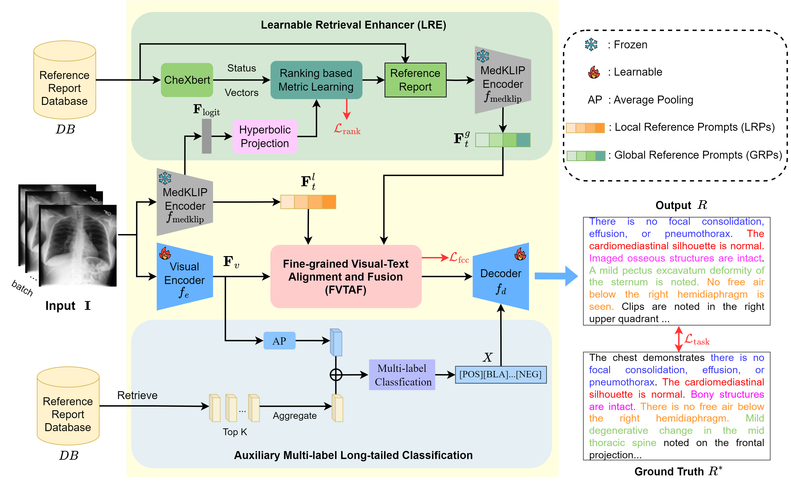

<!-- <div align="center">

## Vision-R1: Evolving Human-Free Alignment in Large Vision-Language Models via Vision-Guided Reinforcement Learning

</div> -->

<div align="center">

<h1> Learnable Retrieval Enhanced Visual-Text Alignment and Fusion for Radiology Report Generation</h1>

<h5 align="center"> If you find this project useful, please give us a star🌟.

</div>

## Framework

<div align=center>

</div>

Automated radiology report generation is essential for improving diagnostic efficiency and reducing the workload of medical professionals. However, existing methods face significant challenges, such as disease class imbalance and insufficient cross-modal fusion. To address these issues, we propose the learnable Retrieval Enhanced Visual-Text Alignment and Fusion (REVTAF) framework, which effectively tackles both class imbalance and visual-text fusion in report generation. REVTAF incorporates two core components: (1) a Learnable Retrieval Enhancer (LRE) that utilizes semantic hierarchies from hyperbolic space and intra-batch context through a ranking-based metric. LRE adaptively retrieves the most relevant reference reports, enhancing image representations, particularly for underrepresented (tail) class inputs; and (2) a fine-grained visual-text alignment and fusion strateg  that ensures consistency across multi-source cross-attention maps for precise alignment. This component further employs an optimal transport-based cross-attention mechanism to dynamically integrate task-relevant textual knowledge for improved report generation. By combining adaptive retrieval with multi-source alignment and fusion, REVTAF achieves fine-grained visual-text integration under weak image-report level supervision while effectively mitigating data imbalance issues. The experiments demonstrate that REVTAF outperforms state-of-the-art methods, achieving an average improvement of 7.4% on the MIMIC-CXR dataset and 2.9% on the IU X-Ray dataset. Comparisons with mainstream multimodal LLMs (e.g., GPT-series models), further highlight its superiority in radiology report generation1.
## Setup
```bash
# Clone the repo
git clone git@github.com:banbooliang/REVTAF-RRG
# Create Env and install basic packages
conda create -n reportenv python=3.10
pip install -r requirements.txt
```

## Download
- Download the **MIMIC-CXR** dataset from the [physionet](https://www.physionet.org/content/mimic-cxr-jpg/2.0.0/), and obtain the corresponding annotation file from [Google Drive](https://drive.google.com/file/d/1qR7EJkiBdHPrskfikz2adL-p9BjMRXup/view?usp=sharing). Put them into ./data/mimic_cxr/ forder. 
- Additionally, download the following files and place them in the same ./data/mimic_cxr/ folder: 

`medclip_text_features.json`

`labels_indices_{split}.json` 

`image_region_score_{split}.json` 

`hash_distance.json` 

`medclip_txt_embeddings.tar.gz` 

`region_txt_embeddings.tar.gz`

These are pre-extracted image and text features generated using the pretrained MedKLIP models on the MIMIC-CXR dataset. You can download them from [here](https://pan.baidu.com/s/1jTfB6u16mS8RvO7rBFWj6A?pwd=577y) and [here](https://pan.baidu.com/s/1eop9x5WqhnR1jQ0psxUwYg?pwd=vq27).


- Download the **IU X-Ray** model from the [R2Gen](https://github.com/zhjohnchan/R2Gen) and the annotation file from the [Google Drive](https://drive.google.com/file/d/1zV5wgi5QsIp6OuC1U95xvOmeAAlBGkRS/view?usp=sharing). Save them in the ./data/iu_xray/ directory.

- Similarly, download the `region_txt_embeddings.tar.gz`, `medclip_txt_embeddings.tar.gz`, and `labels_indices_{split}.json` files for IU X-Ray from [here](https://pan.baidu.com/s/16DYCVFiiHLB_nz-j_4M7JQ?pwd=n1gq) and place them in ./data/iu_xray/.

- To evaluate clinical efficacy, download the `chexbert.pth` model from [Google Drive](https://drive.google.com/file/d/1Qj5yM62FlASGRnW1hH0DDtCENuqGtt7L/view?usp=sharing) and place it in checkpoints/stanford/chexbert/.

## Training
- Run the following command to start training:
```bash 
bash train_mimic_cxr.sh 
```
The trained model will be saved in the results/mimic_cxr/ directory.

## Test
- Run the following command to start testing on the MIMIC-CXR test set and IU X-Ray dataset, respectively:

```bash
bash test_mimic_cxr.sh 
bash test_iu_xray.sh 
```

## Citation
If you find our repository useful, please star this repo and cite our paper.
```bibtex
@misc{zhou2025learnableretrievalenhancedvisualtext,
      title={Learnable Retrieval Enhanced Visual-Text Alignment and Fusion for Radiology Report Generation}, 
      author={Qin Zhou and Guoyan Liang and Xindi Li and Jingyuan Chen and Zhe Wang and Chang Yao and Sai Wu},
      year={2025},
      eprint={2507.07568},
      archivePrefix={arXiv},
      primaryClass={stat.ME},
      url={https://arxiv.org/abs/2507.07568}, 
}
```

## Acknowledgment
* [R2Gen](https://github.com/zhjohnchan/R2Gen)
* [PromptMRG](https://github.com/jhb86253817/PromptMRG)
* [OTSeg](https://github.com/cubeyoung/OTSeg)
* [GW-Regularization](https://github.com/yyf1217/GW-Regularization)

